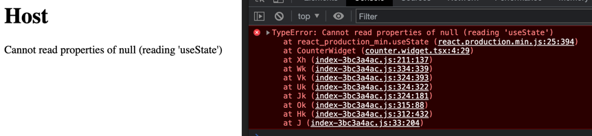

# Bug Reproduction @originjs/vite-plugin-federation



## Steps to reproduce

1. Clone this repo
2. Install deps, build and preview (from the root of the repo)

   ```bash
   pnpm install
   pnpm build
   pnpm preview
   ```
3. open the host application on http://localhost:3000 (opens by default and shows the error)
4. visit the remote application on http://localhost:3001 (works as expected)
